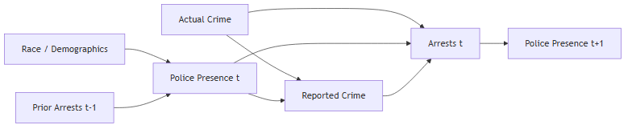

## Abstract

Crime ‌data ‌often ‌gets taken at face value, used to evaluate public safety or train tools toward predictive policing, yet arrests and reported incidents arise directly from how police are deployed, how they record things, and the way in which encounters are logged. This study considers how policing routines produce data that rationalize increased enforcement, treating crime counts as built outcomes of the enforcement system rather than as an independent measure of actual criminal behavior.  Drawing on Duncan Purves’s 2022 take on feedback loops in predictive policing, this breakdown pulls in data on reported incidents, arrests, and investigatory stops from Chicago’s Data Portal, spanning 2016 through 2025, and pieces it into a panel at the community-area level by month to investigate whether said activity predicts later enforcement outcomes after accounting for reported crimes [@purves2022]. The analysis looks for a time-based cycle in which one event feeds back into the other, instead of merely reflecting a shared underlying risk. Chicago’s Strategic Subject List exemplifies how risk scores are built from inputs rooted in arrests and enforcement interactions, making it useful for showing how a system can appear predictive while actually reproducing the same enforcement-driven patterns embedded in the training data. The goal is to shift the debate on algorithmic fairness to focus on the roots of the issue, which are the sources of the data itself.  Much of the current writing dwells on imbalances in what models generate, but here the focus is on the processes that create the training data. Uncovering that policing data closely ties to policing tactics implies that systems built on arrest records could echo those same patterns, even if algorithms are audited and adjusted for bias. Therefore, addressing the issue requires policy interventions that focus on the methods of data collection and organizational accountability, as depending exclusively on model design and construction is insufficient.


## Introduction

When police departments roll out predictive policing algorithms, they make a bold assertion about crime statistics: arrest logs and incident reports serve as trustworthy stand-ins for actual criminal behavior, strong enough to support decisions that affect real people's lives. That core idea underpins the whole approach to predictive policing, and this paper contends it's fundamentally off-base. Instead of tracking crime itself, arrest figures capture outcomes from meetings between officers and citizens, determined by where forces position their people, which actions officers choose to log, and which neighborhoods bear the weight of aggressive patrols. Treating these logs as impartial starting points conflates the products of a law enforcement setup with the very thing that setup aims to assess, and many critics have pointed out this flaw before.

Back in 2016, Lum and Issac were among the first to prove it with numbers by taking drug bust data from Oakland, pairing it with a made-up population setup guessing at real drug use spread, and revealing how arrests were hugely overplayed in Black and poorer districts compared to where drugs were used across the town. When they ran a mock-up of PredPol, an algorithm widely adopted by police agencies, it zeroed in on Black individuals about twice the clip for white ones; not due to higher drug habits among Black residents, but because past patrol habits stacked more busts in those spots. Their breakdown highlighted that these systems don't predict crime; they predict reported crime, and reported crime reflects patrol decisions just as much as actual wrongdoing [@lum2016].

Richardson, Schultz, and Crawford pushed this idea further in 2019 by bringing up "dirty data," records born from departments with proven tracks of rights abuses and bad conduct inside. Looking at spots like Chicago and New Orleans, they claim systems trained on info from unconstitutional patrols don't just mirror old prejudices; they lock them in, keep them going. Their take shifts the focus from tech nitpicks on model precision to legal as well as structural ground: trouble starts way back, in how that training data was made. Put together, those stories lay out the theory side plus some telling examples [@richardson2019].

What they skip, though, and what this paper attempts to address, is a thorough check of the feedback cycle itself. Duncan Purves, in his philosophical analysis of predictive policing, acknowledges the feedback loop objection but characterizes it as "inconclusive," arguing that empirically establishing the self-reinforcing dynamic in any particular system is difficult and that the normative force of the objection depends on evidence that has not yet been systematically supplied. This paper takes that challenge at face value [@purves2022].

Pulling from admin files on Chicago's Data Portal that run from 2016 through 2025, covering crime reports, busts, and street stops across all 77 neighborhoods, this study probes whether cop work at one moment forecasts enforcement results later on, beyond crime report tallies. If earlier stops forecast coming arrests even when you factor out reported events, that would provide direct evidence of the self-reinforcing feedback loop theorized by Lum and Isaac, and which Purves argues has not yet been empirically demonstrated. The approach moves beyond simulation and cross-sectional comparison to test for temporal feedback using lagged regressions on a nine-year community-area-by-month dataset. 

Chicago is a particularly appropriate setting for this test, as it maintains unusually detailed public records of policing activity and has deployed one of the most extensively studied predictive policing tools in the United States: the Strategic Subject List (SSL). This risk-scoring algorithm assigned individuals risk scores based largely on prior arrests and co-arrest network ties. The SSL shows exactly the process Richardson's group outlines, a tool built from information sparked by known wrongdoing, with data-focused inputs looping back to shape future picks. This paper spotlights the SSL as a prime example, tying wider data checks to a solid, in-the-world case.

The contribution of this project is threefold. First, it provides the empirical evidence that prior theoretical and legal accounts have called for but not supplied, directly testing whether policing activity predicts future enforcement independent of crime levels. Second, it situates Chicago's predictive policing infrastructure, including the SSL, within the more extensive data-generating dynamics described in these accounts. Third, it argues that the policy implications reach beyond algorithmic auditing. If policing data are endogenous to policing practices, then systems trained on arrest records will reproduce enforcement patterns regardless of how carefully the model itself is designed.

## Data and Methods
### Data

**Reported Crime Incidents** (Chicago Crimes, 2016–present) are drawn from the Chicago Police Department's (CPD) CLEAR system and record incidents reported to or by police, serving as a proxy for reported crime, less directly driven by officer-initiated activity than arrests, but still shaped by reporting practices and patrol patterns. The key variable is incident count per community area per month [@chicago_crimes_2026].

**Arrest Records** (Chicago Arrests, 2016–present) capture enforcement outcomes produced by CPD activity. Unlike reported incidents, arrests require officer-initiated action and reflect deployment decisions as much as underlying criminal activity. Arrest count per community area per month is the primary enforcement outcome of interest [@chicago_arrests_2026].

**Investigatory Stop Reports (ISR)** (2016–2025) record officer-initiated pedestrian and traffic stops, providing the most direct available measure of police presence and proactive enforcement activity. Stop count per community area per month serves as the primary measure of policing intensity [@chicago_isr_2026].

**American Community Survey (ACS) Data** (2023, 5-year estimates, community-area level) provides time-invariant demographic controls including poverty rate, median household income, and racial composition [@chicago_acs_2026].

**Strategic Subject List (SSL) — Historical** (August 2012–July 2016) is a person-level risk scoring system used by CPD to estimate the likelihood of involvement in a shooting incident. Scores were built from arrest-based features including prior arrests, victimization history, and co-arrest networks. The SSL serves as a case study illustrating how arrest-based data are incorporated into predictive models, and how such systems can reinforce existing enforcement patterns rather than independently measure underlying risk [@chicago_ssl_2026].

*All datasets were downloaded on April 7, 2026.*

### Methods

The causal structure motivating the analysis is represented below. Police presence influences both arrests and reported crime directly, meaning reported crime cannot be treated as a clean measure of underlying criminal activity. The feedback loop of interest runs from arrests at time *t* to police presence at time *t+1*, tested here using one-month lags.



Each of the three administrative datasets is aggregated at the community-area-by-month level: a spatial-temporal unit that makes it possible to compare enforcement and crime patterns throughout neighborhoods over time. For the crimes and arrests datasets, aggregation produces monthly incident and arrest counts within each community area. The ISR dataset, initially recorded at the police beat level, is realigned to the community area schema by assigning each beat to the community area it overlaps with most, ensuring analytic coherence and comparability across all datasets. Months with no recorded activity are kept as zero-count observations to reduce selection bias and maintain the longitudinal panel’s integrity. This approach hinders enforcement metrics from being overstated by focusing only on periods of high police activity.

The datasets are then merged by their common dimensions of community area and month to build a unified analytic panel that supports longitudinal analysis. Demographic variables from the American Community Survey are added at the community area level and treated as fixed, given the sociodemographic stability over the study period. For proper temporal ordering, a necessity for credible causal claims, key variables for stops, arrests, and reported crime are lagged by one month, so each covariate captures its value from the previous month. This structure, reflecting the study’s causal diagram, aims to test whether earlier policing activity actually precedes and plausibly later shapes enforcement outcomes, rather than merely showing coincidental associations at the same time. 

The empirical approach consists of estimating a series of ordinary least squares regression models, each using the current month’s arrest count as the dependent variable. Model 1 includes only the lagged stop count as a predictor, providing a baseline for the association between prior stops and subsequent arrests. Model 2 adds lagged reported crime as an additional covariate, which is a core specification. Since both stops and arrests likely respond to underlying crime, including reported crime, this should push the estimated effect of stops closer to zero. Model 3 further incorporates demographic controls: the proportion of Black residents, the share of households earning under $25,000 a year, and the total population, to assess if neighborhood demographics explain any observed associations. If the coefficient for lagged stops stays significant even after adjusting for reported crime and demographics, that’s taken as evidence for a feedback effect, prior police activity actually shaping subsequent enforcement outcomes.

## Results

### Descriptive Statistics

```{python}
#| echo: false
#| warning: false
import pandas as pd
import plotly.graph_objects as go
import plotly.express as px
from statsmodels.formula.api import ols
from IPython.display import display

df = pd.read_csv('../data/ca_month_dataset.csv')
display(df[['crime_count', 'arrest_count', 'stops_count']].describe().round(1))
```

On average, each Chicago community area saw about 270 reported incidents, 45 arrests, and 105 investigatory stops every month during the study period. However, these numbers weren’t uniform; some neighborhoods faced nearly 10 times as many stops as others, which is a significant gap that illustrates just how much policing levels shifted depending on where you looked. The standard deviations for stops are large, further suggesting that police presence was highly concentrated in certain areas. This variation sets the foundation for analyzing how these patterns of enforcement relate to reported crime and arrests over time.

### City-Wide Trends, 2016–2025

```{python}
#| echo: false
#| warning: false
#| fig-cap: "Monthly totals across all 77 Chicago community areas, 2016–2025."

city = (
    df.groupby(['year', 'month'])[['crime_count', 'arrest_count', 'stops_count']]
    .sum()
    .reset_index()
)
city['date'] = pd.to_datetime(city[['year', 'month']].assign(day=1))

fig = go.Figure()
series = [
    ('crime_count',  'Reported Crime Incidents', '#2c7bb6'),
    ('arrest_count', 'Arrests',                  '#d7191c'),
    ('stops_count',  'Investigatory Stops (ISR)', '#1a9641'),
]
for col, label, color in series:
    fig.add_trace(go.Scatter(x=city['date'], y=city[col], name=label, line=dict(color=color, width=1.5)))

fig.update_layout(
    title=dict(text='Chicago Policing Data, 2016–2025 (City-Wide Monthly Totals)', y=0.97),
    xaxis_title='Month',
    yaxis_title='Count',
    legend=dict(orientation='h', yanchor='top', y=-0.2, xanchor='center', x=0.5),
    height=500,
    margin=dict(t=80, b=120),
    template='plotly_white'
)
fig.show()
```

All three series decline sharply around 2020, consistent with COVID-19 disruptions to both criminal activity and police operations. Investigatory stops show the steepest drop and the slowest recovery, indicating the suspension of CPD stop-and-frisk practices under sustained legal and political pressure during this period.

### Police Stops vs. Arrests by Neighborhood

```{python}
#| echo: false
#| warning: false
#| fig-cap: "Each point is one of Chicago's 77 community areas. Color indicates share of Black residents (ACS 2023)."

area_avg = df.groupby('community_area')[['stops_count', 'arrest_count', 'pct_black']].mean().reset_index()

fig = px.scatter(
    area_avg,
    x='stops_count',
    y='arrest_count',
    color='pct_black',
    color_continuous_scale='RdYlBu_r',
    labels={
        'stops_count': 'Avg. Monthly Investigatory Stops',
        'arrest_count': 'Avg. Monthly Arrests',
        'pct_black': '% Black residents'
    },
    title='Police Stops vs. Arrests by Community Area (2016–2025)',
    opacity=0.8,
    template='plotly_white'
)
fig.update_traces(marker=dict(size=9, line=dict(width=0.5, color='grey')))
fig.update_layout(coloraxis_colorbar=dict(title='% Black<br>residents'), height=450)
fig.show()
```

Neighborhoods with higher average stop counts also record higher average arrests. The color gradient shows that the highest-stop, highest-arrest areas are also the most heavily Black neighborhoods, consistent with racialized deployment patterns documented in the literature. 

### Regression Results

```{python}
#| echo: false
#| warning: false

reg_df = df.dropna(subset=['stops_lag1', 'arrest_lag1', 'crime_lag1'])

m1 = ols('arrest_count ~ stops_lag1', data=reg_df).fit()
m2 = ols('arrest_count ~ stops_lag1 + crime_lag1', data=reg_df).fit()
m3 = ols('arrest_count ~ stops_lag1 + crime_lag1 + pct_black + pct_poverty + population', data=reg_df).fit()

results = pd.DataFrame({
    'Model 1': [
        f"{m1.params['stops_lag1']:.3f}",
        f"({m1.pvalues['stops_lag1']:.3f})",
        '', '', '', '',
        f"{m1.rsquared:.3f}",
        f"{len(m1.fittedvalues):,}"
    ],
    'Model 2': [
        f"{m2.params['stops_lag1']:.3f}",
        f"({m2.pvalues['stops_lag1']:.3f})",
        f"{m2.params['crime_lag1']:.3f}",
        f"({m2.pvalues['crime_lag1']:.3f})",
        '', '',
        f"{m2.rsquared:.3f}",
        f"{len(m2.fittedvalues):,}"
    ],
    'Model 3': [
        f"{m3.params['stops_lag1']:.3f}",
        f"({m3.pvalues['stops_lag1']:.3f})",
        f"{m3.params['crime_lag1']:.3f}",
        f"({m3.pvalues['crime_lag1']:.3f})",
        f"{m3.params['pct_black']:.3f}",
        f"({m3.pvalues['pct_black']:.3f})",
        f"{m3.rsquared:.3f}",
        f"{len(m3.fittedvalues):,}"
    ],
}, index=[
    'Stops (t-1)', '(p-value)',
    'Crime (t-1)', '(p-value)',
    '% Black', '(p-value)',
    'R²', 'N'
])

display(results)
```

Prior police stops consistently predict arrests in the current month, regardless of the model used. In Model 1, stops alone account for 71% of arrest variance. When you add prior reported crime to Model 2, the coefficient for stops drops from `0.353` to `0.198`, yet it remains highly significant (`p < 0.001`). So, if a neighborhood had 100 more stops last month, you can expect about 20 extra arrests this month, even when crime levels are the same. Model 3 brings in demographic controls, and the pattern holds steady (`coef = 0.184`, `p < 0.001`), with `R²` jumping to `0.826`. The stop coefficient remains strong across all three setups, pointing to a clear feedback loop: police activity drives enforcement outcomes beyond what crime reports would predict.

## Policy Recommendations

It’s important for policymakers to recognize that the problem doesn’t lie solely in the models themselves; it lies in the data-generating process. Conversations about how to fix predictive policing mostly focus on algorithmic transparency, testing bias, and audit models, all of which matter but address the wrong part of the problem. If you’re using data that’s shaped by old enforcement patterns instead of actual crime rates, even a fair, technically sound algorithm just repeats those original biases. It ends up magnifying disparities instead of fixing them. The real problem starts earlier, with how the data gets made. Policy changes need to target that step. This paper offers three recommendations for city governments, police oversight agencies, and federal bodies overseeing or funding predictive policing.

### Audit the Data-Generating Process Before Using Any Tool

Any predictive policing tool that uses arrest records, stop data, or other officer-initiated enforcement outcomes as training inputs shouldn’t be deployed without a thorough audit of the data-generating process.  Distinctive from an algorithmic audit, this type of audit wouldn’t just check whether model p from an algorithmic audit; it would check whether predictions land fairly across demographic lines; it would also assess whether the inputs themselves faithfully reflect what the model claims to predict. Specifically, this audit would to require the deploying agency to document: what share of training data comes from officer-initiated activity versus civilian-reported incidents, whether stop and arrest rates in the training data vary systematically by neighborhood racial composition after controlling for reported crime, and whether the model has been tested on citizen-reported crime as an alternative input. If a department cannot prove that its training data reflects something other than prior enforcement patterns, deployment should not be approved.

Chicago's Strategic Subject List is a case study in what happens without this requirement. The SSL assigned risk scores based heavily on prior arrests and co-arrest network ties, both of which, as this analysis shows, are predicted by prior police presence independent of reported crime. The model ended up predicting mainly where officers already focused, not where risk was higher. If anyone had required a data audit up front, the system would've failed that test before it ever influenced any real decision. A data audit requirement would have flagged this before the system was used to make real decisions about real people.

### Separate Officer-Initiated Data from Civilian-Reported Data in All Public Safety Reporting

Police departments should be required to break down their safety data by where it comes from and how it was generated, such that reported crime incidents initiated by civilian calls for service should be tracked and reported separately from officer-initiated enforcement activity, such as investigatory stops, proactive arrests, and field interviews.  Right now, departments usually lump all these numbers together into unified crime statistics, which makes it hard to tell whether “crime data” actually reflects crime or just reflects where police choose to focus.

Splitting up the data builds accountability; policymakers and the public can see directly how much of a department's recorded crime activity is officer-generated versus civilian-reported. Further, it also produces cleaner inputs for any future predictive tools; civilian-reported incidents are not perfect, but they’re less subject to the feedback loop dynamics documented here. 

Second, it cleans up the data, especially for any future predictive tools. Civilian-reported incidents aren’t perfect, but they’re less tangled in the endless feedback loops that happen when police rely on their own enforcement numbers. Lum and Isaac (2016) pointed this out, a system using citizen reports instead of arrest data is less tangled in the endless feedback loops that happen when police rely on their own enforcement numbers. Lum and Isaac (2016) pointed this out, a system using citizen reports instead of arrest data is less likely to spin itself into a loop.

### Establish Sunset Requirements for Arrest-Based Risk Models

Any system that scores risk based on arrest data needs a built-in sunset review, with no longer than three years between reviews.  During this review, the model should be evaluated for predictive accuracy and evidence of the feedback loop documented here: specifically, whether the neighborhoods or individuals flagged by the model have higher subsequent arrest rates because they were targeted, rather than because they posed independently measurable higher risk.

This recommendation follows directly from the causal structure used throughout this paper. When a model sends police to a neighborhood,, it generates arrests there, which feed back into the model as confirmation that the neighborhood is high risk. Without a formal sunset review to pick up on this, a model can persist indefinitely while its apparent accuracy is a result of its own targeting decisions rather than genuine predictive validity. The SSL operated without this kind of review until it was decommissioned in 2019, a process driven by FOIA litigation from the Chicago Sun-Times, sustained advocacy from the ACLU of Illinois, and a published investigation by Upturn that found the model's scores were driven almost entirely by age rather than any meaningful risk signal [@aclu_il_2020; @upturn2017]. Sunset requirements would institutionalize what currently depends on outside pressure.

## Conclusion

The central argument of this paper is that policing data is not a neutral starting point; it is an output of an enforcement system, shaped by where departments deploy officers, which encounters get recorded, and which communities bear the weight of proactive policing. When that data is fed into predictive systems, the patterns embedded within get projected forward as risk, creating a closed loop in which policing justifies itself. The three recommendations above do not suggest the complete elimination of predictive tools or the dismantling of existing systems; instead, they ask the institutions that use these tools to understand what their training data actually measures. Auditing the data-generating process, separating officer-initiated from civilian-reported data, and including sunset reviews in the model’s lifecycle are practical steps that sincerely address the root cause in ways algorithmic fairness pursued in isolation cannot. Without them, algorithmic fairness actually perpetuates rather than remedies inequality


